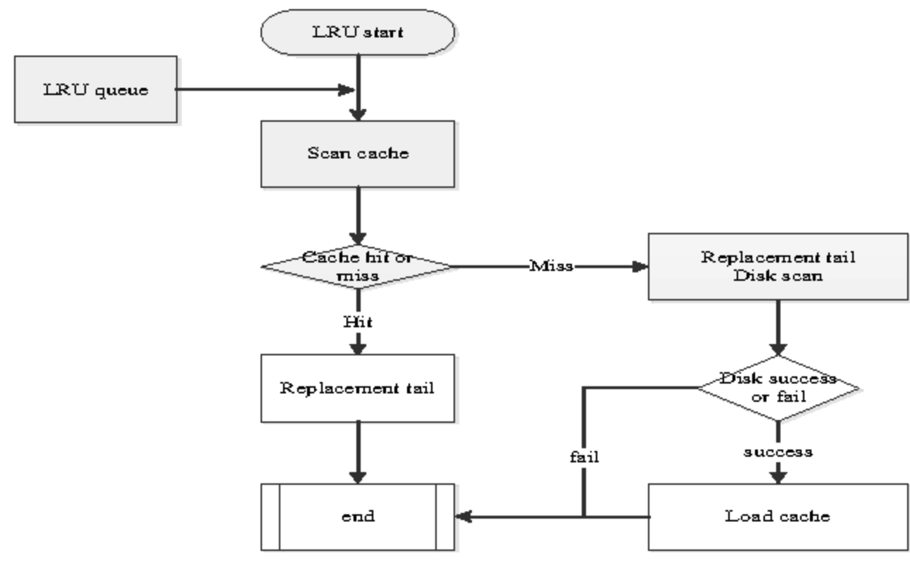

# LRU Cache 

## Data Structure:
We use two dats structures to implement an LRU Cache. 

* A doubly-linked list:  

```
Each node is a page.
The most recently used page will be Head node and least recently used page will be tail node
```

* Hash Map   

```
A Hash Map with page number as key and address of the corresponding page (list) node as value.
```
Algorithm:




