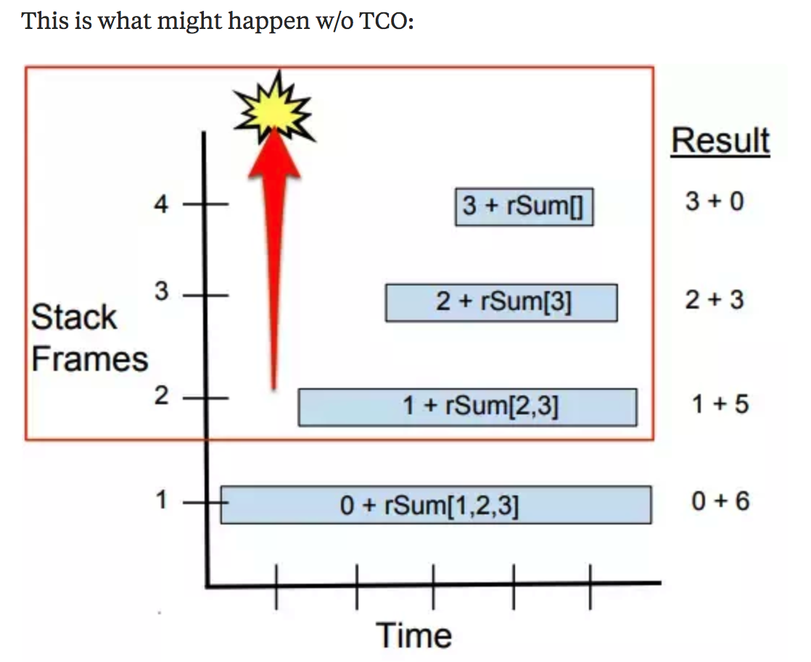
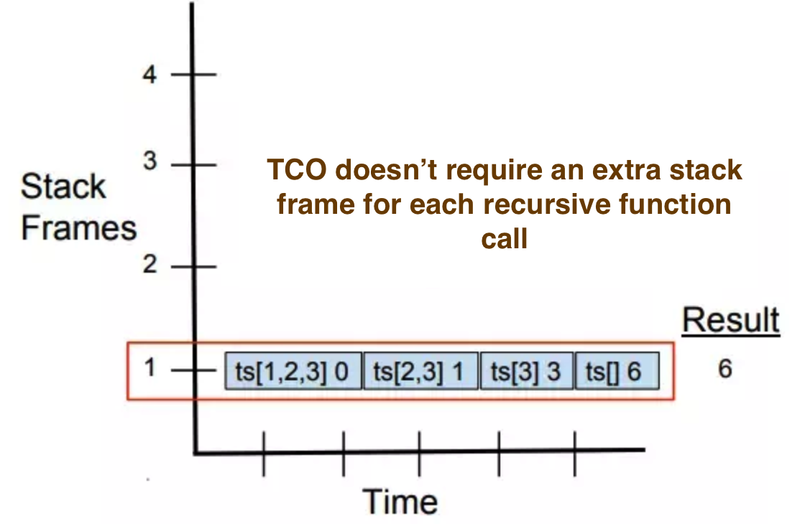

# What is Tail Recursion?

 
Tail recursion is a special kind of recursion where the recursive call is the very last thing in the function. It's a function that does not do anything at all after recursing.

This is important because it means that you can just pass the result of the recursive call through directly instead of waiting for it—you don't have to consume any stack space. A normal function, on the other hand, has to have a stack frame so that the compiler knows to come back to it (and have all the necessary variable values) after the recursive call is finished.

You can always rewrite your tail recursive function as a loop—which are, presumably, guaranteed to run in constant space. Better yet, you can always switch to a language that *does* support proper tail calls 

# Does NodeJs support Tail Call Optimization (TCO)?

If not, it depends on what you’re doing and how much RAM your compute resource has. In Java, unless you’re using a performance limiting techniques like trampolining, Java will limit your program to a few thousand recursive calls.

In Node.JS version 8 and later, TCO is not available. link https://node.green/

V8, the JavaScript engine in Chrome, had TCO support for a while, but it no longer does and as of this writing, there is no active development on TCO in V8, and none is planned. 

This is what might happen w/o TCO:  

  

With TCO, our stack frames do not need to be preserved. Here’s a recursive Haskell function whose stack requirements are illustrated in the diagram below.

  

[Tail Call Optimization](https://www.youtube.com/watch?v=L1jjXGfxozc)

